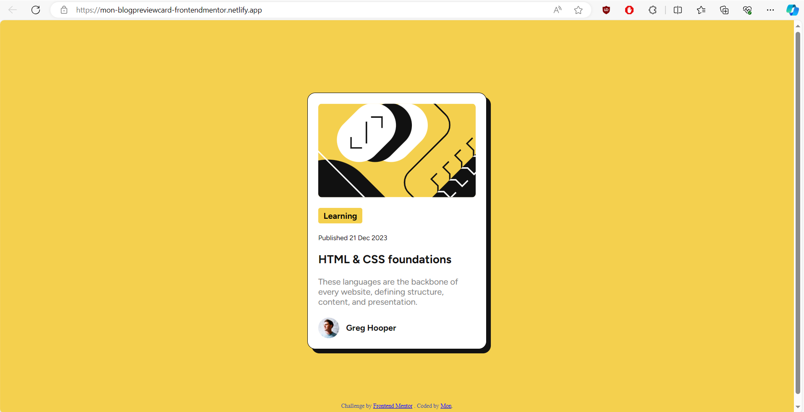
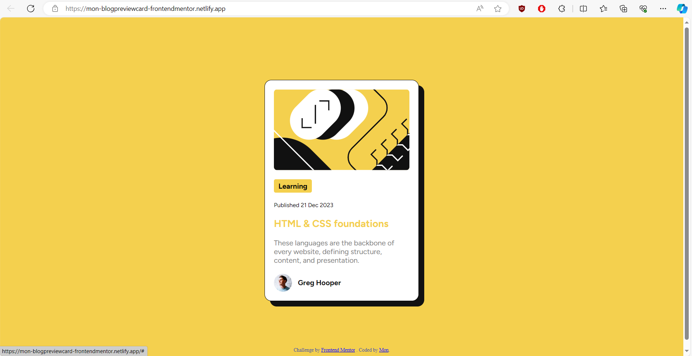
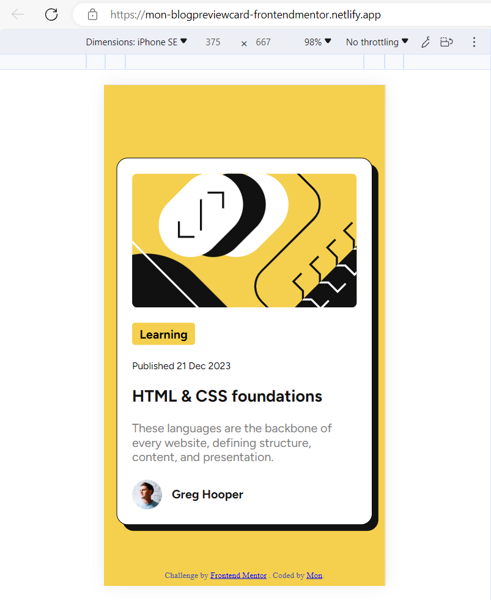

# Frontend Mentor - Blog preview card solution

This is a solution to the [Blog preview card challenge on Frontend Mentor](https://www.frontendmentor.io/challenges/blog-preview-card-ckPaj01IcS). Frontend Mentor challenges help you improve your coding skills by building realistic projects. 

## Table of contents

- [Overview](#overview)
  - [The challenge](#the-challenge)
  - [Screenshot](#screenshot)
  - [Links](#links)
- [My process](#my-process)
  - [Built with](#built-with)
  - [What I learned](#what-i-learned)
  - [Continued development](#continued-development)
  - [Useful resources](#useful-resources)
- [Author](#author)
- [Acknowledgments](#acknowledgments)

## Overview

### The challenge

Users should be able to:

- See hover and focus states for all interactive elements on the page

### Screenshot





### Links

- Solution URL: [GitHub](https://github.com/mon-68kg/blog-preview-card-solution)
- Live Site URL: [Netlify](mon-blogpreviewcard-frontendmentor.netlify.app)

## My process

### Built with

- Semantic HTML5 markup
- CSS custom properties
- Flexbox

### What I learned

I gained more understanding about max-width and min-width and how useful they are in developing responsive website pages. I also learned to import/use a local font. I also learned to about 'fit-content'. And I also learned how to deploy site using netlify.

```html
<h1>Some HTML code I'm proud of</h1>
```
```css
.card {
    max-width: 300px;
    display: flex;
    flex-direction: column;
    background-color: hsl(0, 0%, 100%);
    border: 1px solid black;
    border-radius: 15px;
    padding: 20px;
    box-shadow: 8px 8px hsl(0, 0%, 7%);
    transition: box-shadow .5s;
}
.learning {
    background-color: hsl(47, 88%, 63%);
    font-weight: bold;
    width: fit-content;
    padding: 5px 10px 5px;
    border-radius: 4px;
}
```

### Continued development

I want to learn more about transitions, transforms and generally on how to create animations.

### Useful resources

- [w3schools](https://www.w3schools.com/) - This helped a lot in coding and accomplishing this challenge.
- [google](https://www.google.com/) - This is very helpful.

## Author

- GitHub - [@mon-68kg](https://github.com/mon-68kg)
- Frontend Mentor - [@mon-68kg](https://www.frontendmentor.io/profile/mon-68kg)

## Acknowledgments

I want to thank all people who provide, share and contribute knowledge, ideas and informations about coding. I also want to thank all trees and plants who provide oxygen for us.
